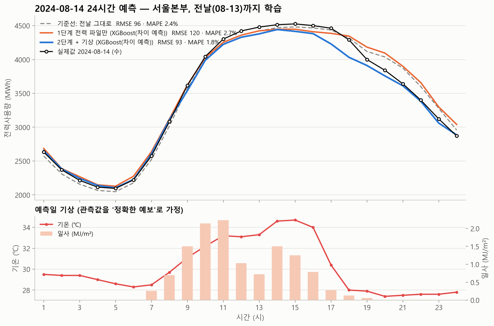
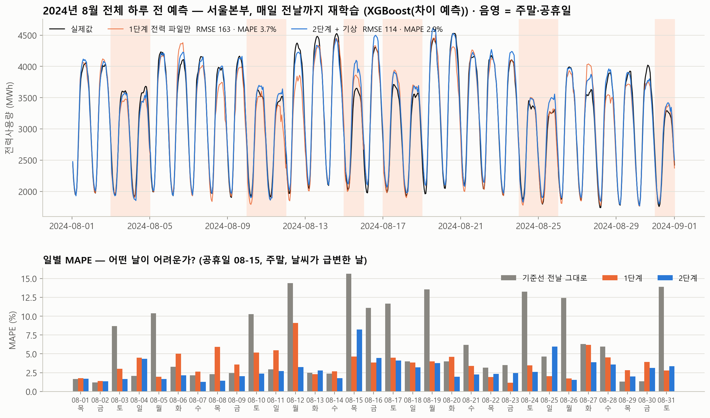
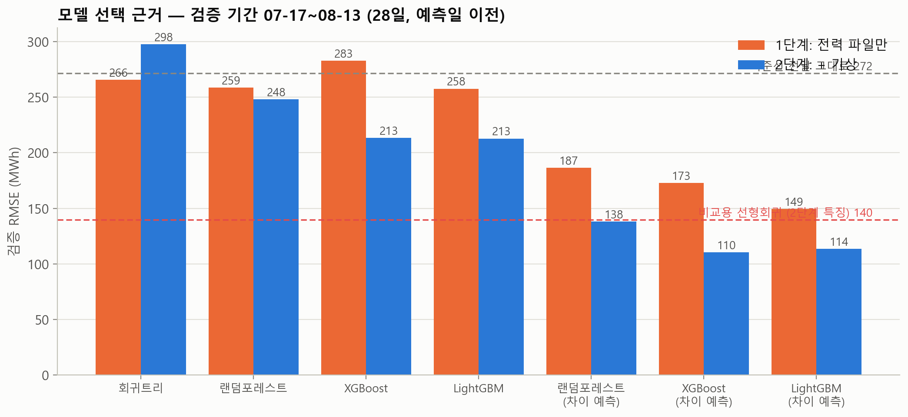
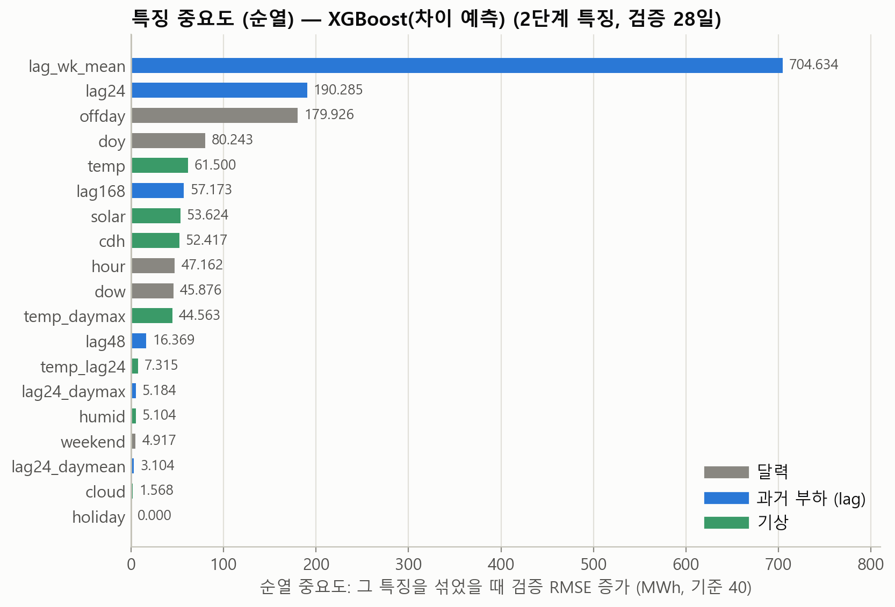

# 서울본부 시간별 전력수요 하루 전 예측 — 2024-08-14 · 2024년 8월 전체

트리 모델(회귀트리 · 랜덤포레스트 · XGBoost · LightGBM)로 **서울본부**의 다음 날 24시간 전력사용량을 예측한다.

| 단계 | 사용 데이터 | 예측 대상 |
|---|---|---|
| 1단계 | 한전 시간별 전력사용량 파일만 | 2024-08-14 (수) 24시간 |
| 2단계 | + 기상청 ASOS 서울(108) 시간별 기상 | 2024-08-14 (수) 24시간 |
| 3단계 | 1·2단계 특징 각각 | 2024-08-01 ~ 08-31 (31일 × 24시간), 매일 전날까지 재학습 |

## 1. 결과 (RMSE MWh · MAPE %)

### 2024-08-14 24시간 (전날 08-13까지 학습)

| 모델 | 1단계 전력만 | 2단계 +기상 |
|---|---:|---:|
| 기준선: 전날 그대로 | 96.2 · 2.4% | – |
| 기준선: 지난주 같은 요일 | 248.9 · 5.7% | – |
| 회귀트리 | 188.4 · 4.2% | 176.9 · 3.8% |
| 랜덤포레스트 | 118.4 · 3.1% | 132.6 · 2.2% |
| XGBoost | 149.5 · 3.1% | 170.8 · 2.9% |
| LightGBM | 166.1 · 3.3% | 145.9 · 3.0% |
| 랜덤포레스트 (차이 예측) | 206.4 · 4.9% | 103.5 · 2.7% |
| XGBoost (차이 예측) | 142.9 · 3.2% | 109.7 · 2.2% |
| LightGBM (차이 예측) | 122.0 · 2.9% | 79.5 · 2.2% |
| **XGBoost (차이 예측) — 튜닝 (최종)** | **120.1 · 2.7%** | **93.5 · 1.8%** |

08-14는 전날(08-13)과 날씨·요일 성격이 거의 같아 "전날 그대로" 기준선이 유난히 강한 날이다. 하루 24점만으로는 모델 우열을 말하기 어렵다는 것이 3단계를 둔 이유다.



### 2024년 8월 전체 (31일, 매일 전날까지 재학습 → 다음 날 예측)

| 모델 | RMSE | MAPE |
|---|---:|---:|
| 기준선: 전날 그대로 | 326.2 | 6.4% |
| 기준선: 지난주 같은 요일 | 241.9 | 5.5% |
| 1단계 전력만 · XGBoost(차이 예측, 튜닝) | 162.6 | 3.7% |
| **2단계 +기상 · XGBoost(차이 예측, 튜닝)** | **113.9** | **2.9%** |



일별 오차는 `results/03_8월_일별_오차.csv`. 어려운 날은 공휴일 08-15(광복절, 2단계 MAPE 8.2%)와 주말→월요일 전환, 폭염이 꺾이거나 비가 온 날이다. 기준선은 그런 날마다 10~15%까지 튄다.

## 2. 왜 이 모델인가 — 검증으로 골랐다

예측일 **이전** 28일(07-17 ~ 08-13)을 검증 구간으로 두고, 그 구간의 RMSE로 모델·특징·학습기간·하이퍼파라미터를 골랐다. 예측일 08-14의 값은 선택에 전혀 쓰지 않았다.



| 검증 RMSE (28일) | 1단계 | 2단계 |
|---|---:|---:|
| 기준선 전날 그대로 | 271.7 | – |
| 회귀트리 | 265.7 | 297.6 |
| 랜덤포레스트 | 258.6 | 248.1 |
| XGBoost | 282.9 | 213.4 |
| LightGBM | 257.7 | 212.8 |
| 랜덤포레스트 (차이 예측) | 186.5 | 138.0 |
| **XGBoost (차이 예측)** | 172.8 | **110.3 → 튜닝 후 99.7** |
| LightGBM (차이 예측) | 149.5 | 113.5 |

**핵심 발견: 트리는 외삽을 못 한다.** 2024년 8월은 기록적 폭염으로 수요가 학습 데이터(2022~) 최고치 근처 또는 그 이상이었다. 트리는 잎의 평균값만 내놓으므로 학습 범위를 넘는 값을 만들 수 없고, 그래서 값을 직접 예측하는 트리(위 표의 상단 4줄)는 기준선을 겨우 넘거나 못 넘었다.
그래서 **타깃을 바꿨다**: `y` 대신 `y − 지난 7일 같은 시각 평균`(차이)을 트리로 예측하고 나중에 다시 더한다. 차이는 늘 비슷한 범위에 있어 트리가 잘 다루고, "요즘 수준"은 lag 특징이 실어 나른다. 이 한 줄로 검증 RMSE가 213 → 110으로 절반이 됐다 (`DiffModel` 클래스).

비교용 선형회귀(2단계 특징)는 검증 RMSE 140이었다. 선형모델은 외삽이 되기 때문에 값을 직접 예측하는 트리보다는 좋았지만, 차이 예측 트리에는 못 미쳤다.

XGBoost와 LightGBM(차이 예측)은 검증에서 사실상 동률(110 vs 114)이다. 검증 RMSE가 더 낮은 XGBoost를 골랐고, LightGBM을 골랐어도 결론은 같다.

## 3. 왜 이 변수인가

모든 특징은 **예측일 전날 24시까지 아는 값**으로만 만들었다(부하 lag ≥ 24시간). 기상은 예측일 당일 관측값을 "정확한 예보"로 가정해 썼다 (실무에서는 기상예보로 대체해야 하며, 예보 오차만큼 성능이 내려간다).

| 그룹 | 변수 | 넣은 이유 |
|---|---|---|
| 달력 | hour, dow, weekend, holiday, offday, doy | 하루·주간 패턴, 공휴일(08-15), 계절 위치 |
| 과거 부하 | lag24 (전날 같은 시각), lag48, lag168 (지난주 같은 요일), lag_wk_mean (지난 7일 같은 시각 평균), lag24_daymean·daymax (전날 수준) | "요즘 수준"과 요일 패턴. lag_wk_mean은 차이 예측의 기준값이기도 함 |
| 기상 (2단계) | temp, humid, solar, cloud, cdh (기온−24℃ 초과분 = 냉방 수요), temp_daymax, temp_lag24 | 여름 수요는 냉방이 좌우. 전날 기온 대비 변화가 "전날 그대로"가 틀리는 이유 |

순열 중요도(검증 28일에서 특징 하나를 섞었을 때 RMSE 증가):



lag_wk_mean이 압도적인 것은 차이 예측의 기준값이라 당연하고, 그다음이 lag24·offday·doy·temp·solar·cdh 순이다. 기상 변수는 개별 중요도는 크지 않지만 **다 같이 넣었을 때** 8월 전체 MAPE가 3.7% → 2.9%로 내려갔다. holiday의 순열 중요도가 0인 것은 검증 28일에 공휴일이 없어서다(offday가 주말을 대신 설명).

## 4. 튜닝은 어떻게 했나

모두 검증 28일 RMSE 기준, 순서대로:

1. **특징 세트**: 1단계(달력+lag) vs 2단계(+기상) → 2단계.
2. **모델**: 7개 후보 → 차이 예측 XGBoost.
3. **학습 기간**: 최근 8주 / 최근 1년 / 전체(2022~) → 전체. (차이 예측은 수준 변화에 둔감해서 긴 기간이 유리했다. 값을 직접 예측하는 모델은 최근 기간이 유리한 경우가 있었다.)
4. **하이퍼파라미터** 27조합 격자: n_estimators {300, 600, 1000} × learning_rate {0.02, 0.05, 0.1} × max_depth {3, 5, 7} → **1000 · 0.1 · depth 3** (검증 RMSE 110.3 → 99.7). 얕은 트리를 많이 쌓는 쪽이 이겼다. 전체 표는 `results/00_검증_하이퍼파라미터.csv`.
5. 3단계는 고른 설정 그대로 **매일 전날까지 다시 학습**해 다음 날을 예측했다(하루 전 예측을 그대로 흉내).

## 5. 실행

```bash
pip install -r requirements.txt
python forecast.py        # 약 7분 (검증 1분 · 튜닝 3분 · 8월 rolling 3분)
```

```
forecast.py                 전체 파이프라인 (데이터 → 특징 → 검증·튜닝 → 08-14 예측 → 8월 rolling → 그림·표)
data/                       한전 본부별 시간별 전력사용량 (2022~2024), 기상청 ASOS 서울 108 시간별 (2021~2025)
results/                    검증표·결과표·일별 오차·시간별 예측 CSV, 선택요약.txt
figures/                    검증 비교 · 08-14 예측 · 특징 중요도 · 8월 전체
```

데이터 처리 메모: 한전 `기준시 h`는 h시에 끝나는 한 시간(1~24)으로 보고 `날짜 + h시간`을 시각으로 썼다(24시 = 다음 날 00:00). 기상은 같은 시각의 ASOS 정시 관측을 붙였고, 3시간 이하 결측만 보간, 일사 결측(밤)은 0.
